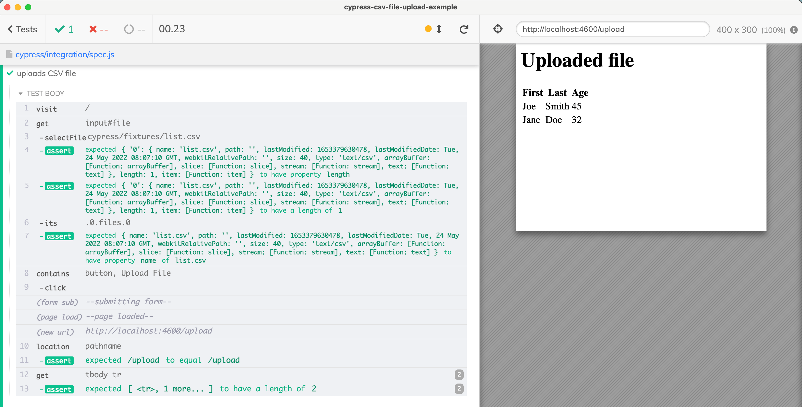

# cypress-csv-file-upload-example

> Upload the CSV file and confirm the server shows the uploaded rows



See [spec.js](./cypress/integration/spec.js)

## Run

```
# install the dependencies
$ npm install
# start the server and open Cypress
$ npm run dev
# click on the "spec.js" file
```
